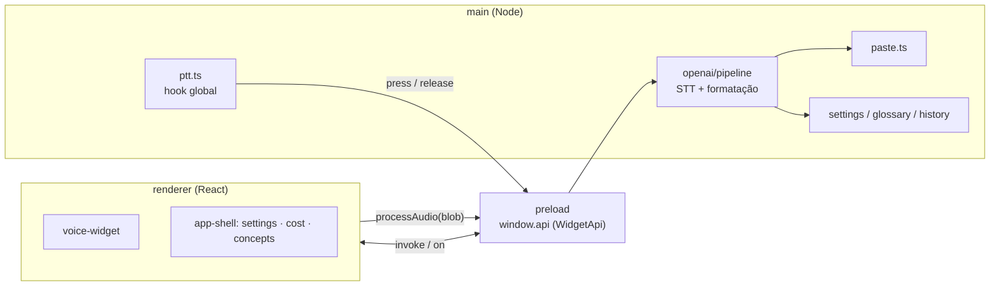
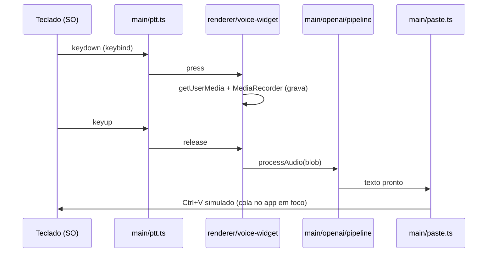

# Arquitetura

PSTranscribe é um app Electron com três processos que só conversam por IPC. O
main é o único com acesso ao SO, ao disco e à chave da OpenAI; o renderer é só
UI; o preload é a ponte estreita entre os dois.

## Camadas

- **main** — `index.ts` registra os handlers de IPC, cria o tray e o widget e
  liga o push-to-talk. Todo acesso a SO/rede/chave passa por aqui.
- **preload** — expõe só `window.api` (tipo `WidgetApi` em `src/shared/ipc.ts`),
  com `contextIsolation` sempre ativo. O renderer nunca vê o `ipcRenderer` cru.
- **renderer** — React, roteado pelo hash da janela (sem hash = widget, `#app` =
  shell, `#conceitos` = glossário).

## Fluxo push-to-talk

O keybind vem de `uiohook-napi` (hook global, funciona com o app em background).
A gravação acontece no renderer porque `getUserMedia`/`MediaRecorder` são APIs de
navegador; o áudio bruto (webm/opus) volta ao main para processar.

## Pipeline STT → formatação → colar

`main/openai/pipeline.ts` recebe o áudio e, respeitando as flags dos settings:

1. **STT** (`stt.ts`) — transcreve com `gpt-4o-transcribe` (ou
   `gpt-4o-mini-transcribe` no modo rápido; `whisper-1` como fallback).
2. **Autocorreção** (`glossary.ts`) — corrige termos do glossário no texto bruto,
   localmente, sem rede.
3. **Formatação** (`format.ts`) — `gpt-5.4-mini` pontua e limpa o texto (pulada
   se a flag `formatar` estiver off ou `FORMAT_LOCKED`).
4. **Colar** (`paste.ts`) — coloca o resultado no clipboard, dispara `Ctrl+V` via
   PowerShell `SendKeys` e restaura o clipboard anterior.

O uso é registrado em `history.ts` (métricas, sem o texto — privacidade).

> Transcrição em tempo real (`openai/realtime.ts` + `voice-widget/pcmRecorder.ts`)
> existe mas está **desligada** por flag (`REALTIME_ENABLED = false`) — fora do
> fluxo atual.
